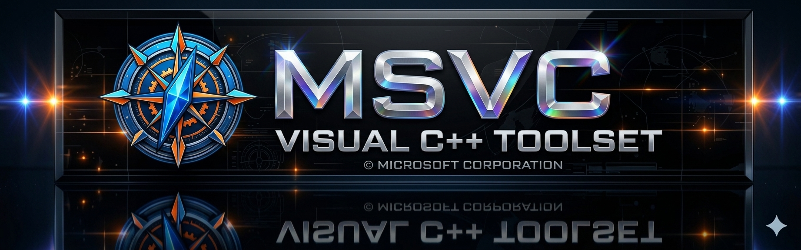

<a target="_self" title="CLICK HERE to ENTER the GATEWAY FREE!" href="https://mercwar.github.io/Constellation/index.html">

</a>

# ⚡ Navigator MSVC Academy  
### Official Windows Systems Engineering & Native Graphics Curriculum

<p align="center">
 <a target="_self" title="CLICK HERE to ENTER THE Mercwar AI portal!" href="https://mercwar01.byethost3.com"> 
   
 </a>
</p>

This version follows:

- 📘 Microsoft Docs formatting conventions  
- 🧩 MSVC / Win32 / DirectX documentation tone  
- 📐 ISO/IEEE technical structuring  
- 🏛️ Professional open‑source README standards  
- 🧼 Clean, formal, enterprise‑grade language  
- 🔱 MercWar branding **only at the end**

---

<p align="center">
  
</p>

---

# 🧭 SECTION I — INTRODUCTION  
## 1. Overview  
Navigator MSVC Academy is a structured, low‑level engineering curriculum designed to teach developers how to build native Windows applications and graphics systems using:

- 🔹 C99 / ANSI C  
- 🔹 Win32 API  
- 🔹 MSVC toolchain  
- 🔹 DirectX 11  
- 🔹 AVIS subsystem routing  

<p align="center">
 <a target="_self" title="CLICK HERE to ENTER THE GATEWAY FREE!" href="https://mercwar.github.io/Navigator-MSVC-Academy/index.html"> 
   
 </a>
</p>

The academy provides a self‑contained learning environment:

- 🛠️ Suitable for systems programmers  
- 🚀 Engine developers  
- 🎨 Graphics engineers  

## 2. Objectives  
- 🖥️ Windows kernel interactions  
- 🪟 Win32 subsystem implementation  
- ⚙️ MSVC compilation pipeline optimization  
- 🎮 DirectX hardware initialization  
- 🔧 AVIS subsystem integration  

## 3. Scope  
The curriculum covers:

- 🧠 Memory management  
- 🪟 Window creation and message routing  
- 🛠️ Compiler and linker configuration  
- 🎨 Graphics device initialization  
- 🧩 Subsystem architecture design  

All content is delivered through modular HTML chapters accessible online or offline.

---

# 🏗️ SECTION II — TECHNICAL ARCHITECTURE  
## 1. AVIS Subsystem Specification  
| Subsystem | Description | Implementation | Memory Model |
|----------|-------------|----------------|--------------|
| **CBORD** | Bootstrap Layer | Custom `/ENTRY` startup; CRT‑free initialization | Fixed‑size arena allocation |
| **CYBORG** | Command Bus | Zero‑allocation ring‑buffer dispatch | Linear sliding window |
| **CYHY** | Diagnostics | SEH vectoring; hardware register tracing | Manual telemetry output |
| **MERC‑G** | Render Core | DirectX state‑machine routing | Direct C‑struct → GPU buffer mapping |

## 2. Learning Phases  
- 📘 **Phase 1 — C Foundations**  
- 🪟 **Phase 2 — Win32 Subsystem**  
- ⚙️ **Phase 3 — MSVC Toolchain**  
- 🎮 **Phase 4 — DirectX Graphics**  
- 🔱 **Phase 5 — AVIS Engine Integration**

## 3. Directory Structure  
```
Navigator-MSVC-Academy/
├── index.html
├── html/
├── css/
├── js/
└── assets/
```

---

# 🧰 SECTION III — OPERATIONS & USAGE  
## 1. Accessing the Tutorial  
Online version:  
🔗 **https://mercwar.github.io/Navigator-MSVC-Academy/**

## 2. Cloning the Repository  
```bash
git clone https://github.com/your-user/navigator-msvc-academy.git
cd navigator-msvc-academy
```

## 3. Running Offline  
```bash
python -m http.server 8080
```

Open:  
```
http://localhost:8080/index.html
```

## 4. MSVC Compilation Reference  
```batch
@echo off
cl.exe /GS- /Gs1048576 /O2 /Oi /W4 /TC /Fe:navigator_engine.exe ^
    src/main.c ^
    /link /NODEFAULTLIB /ENTRY:CBORDStartup ^
    kernel32.lib user32.lib gdi32.lib d3d11.lib dxgi.lib
```

---

# 🛠️ SECTION IV — DEVELOPMENT & CONTRIBUTION  
## 1. Coding Standards  
- 📘 C99 / ANSI C  
- 🧼 Pure HTML documentation  
- 🚫 No external frameworks  
- 🚫 No runtime dependencies  
- 🪶 Minimal binary footprint  

## 2. Contribution Guidelines  
1. 🍴 Fork the repository  
2. 🔱 Follow AVIS subsystem conventions  
3. 📤 Submit pull requests to `main`  
4. 🧩 Maintain low‑level, no‑bloat design principles  

## 3. Document Status  
This curriculum is:

- ❗ **Unofficial Microsoft**  
- 🔱 **MercWar Official**

---

# 🌐 SECTION V — MERCWAR USER OPERATIONS  
## 1. Delivery Channels  
### Online  
- 🌍 GitHub Pages version  
- 📑 Sidebar navigation  
- ⚡ AJAX chapter loader  

### Offline  
- 📦 Clone repository  
- 🖥️ Open `index.html` locally  

## 2. Navigation  
The interface includes:

- 📚 Left navigation sidebar  
- 🖥️ Central content frame  
- ⚡ Dynamic chapter loading  
- 🔱 AVIS‑aligned formatting  

## 3. Chapter Index  
- 📘 **C Foundations** — 01–10  
- 🪟 **Win32 Subsystem** — 11–18  
- ⚙️ **MSVC Toolchain** — 19–22  
- 🎮 **DirectX Graphics** — 23–28  
- 🔱 **AVIS Architecture** — 29–30  

---

# ⚖️ SECTION VI — LEGAL NOTICE  
## 1. Document Status  
This tutorial is provided as:

- 🔱 **MercWar Official Documentation**  
- ❗ **Unofficial Microsoft Curriculum**

## 2. Copyright  
Users may:

- 🌐 Read online  
- 📦 Clone the repository  
- 🖥️ Run offline  
- 📚 Reference for educational use  

Users may not:

- 🚫 Claim Microsoft affiliation  
- 🚫 Redistribute under Microsoft branding  
- 🚫 Remove MercWar attribution  

## 3. Technical Accuracy  
All technical descriptions of:

- 🪟 Win32 API  
- ⚙️ MSVC toolchain  
- 🎮 DirectX pipeline  
- 🖥️ Windows subsystem behavior  

are provided for educational purposes.  
Users should consult official Microsoft documentation for authoritative references.

## 4. AVIS Subsystem Trademark  
The AVIS subsystem architecture (CBORD, CYBORG, CYHY, MERC‑G) is part of the **MercWar Official** ecosystem.

- 🚫 Not a Microsoft technology  
- 🚫 Not part of Windows OS  
- 🚫 Not recognized as an official subsystem  

---

<p align="center">
  <strong>🔱 MERCWAR OFFICIAL DOCUMENTATION  
  ❗ UNOFFICIAL MICROSOFT CURRICULUM  
  🛰️ NATIVE WINDOWS ENGINEERING CONSTELLATION</strong>
</p>
